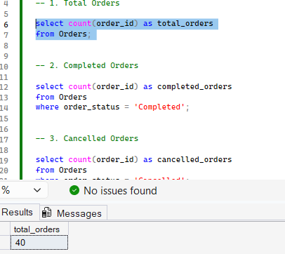

# Retail Sales Analytics – SQL Project

## Project Overview

This project analyzes retail sales data using SQL Server. The goal is to understand sales performance, customer behavior, product performance, and order trends.

## Tools Used

* SQL Server
* SQL Server Management Studio (SSMS)

## Database Tables

* **Customers** – Customer details
* **Products** – Product names and categories
* **Orders** – Order dates and order status
* **Order_Details** – Product quantities and prices

## Project Structure

* `01_Create_Database.sql` – Create the database
* `02_Create_Tables.sql` – Create tables
* `03_Insert_Data.sql` – Insert sample data
* `04_Analysis.sql` – Analyze sales, products, customers, and monthly revenue
* `05_KPIs.sql` – Calculate key business metrics

## Key KPIs

| KPI                 |    Result |
| ------------------- | --------: |
| Total Orders        |        40 |
| Completed Orders    |        30 |
| Cancelled Orders    |         4 |
| Total Units Sold    |        81 |
| Total Revenue       | $5,834.19 |
| Average Order Value |   $194.47 |
| Unique Customers    |        15 |
| Cancellation Rate   |    10.00% |

## Key Findings

* Furniture generated the highest revenue: **$2,349.87**.
* Wireless Mouse was the top-selling product, with **9 units sold**.
* Sophia Anderson (Customer 6) generated the highest customer revenue: **$689.90**.
* May 2025 had the highest monthly revenue: **$489.96**.
* The highest monthly revenue growth was **226.71% in May 2025**.

## SQL Skills Practiced

* SELECT, WHERE, ORDER BY
* INNER JOIN and LEFT JOIN
* GROUP BY and aggregate functions
* COUNT, SUM, AVG, ROUND, and CAST
* CASE and DISTINCT
* Common Table Expressions (CTEs)
* LAG() window function
* Month-over-month revenue growth

## Project Highlights

* Created a retail sales database with four related tables: Customers, Products, Orders, and Order_Details.
* Wrote SQL queries to analyze 40 orders, product sales, customer revenue, and order statuses.
* Calculated key business metrics, including total revenue, average order value, and cancellation rate.
* Used joins, aggregate functions, a CTE, and the `LAG()` window function to explore sales trends and month-over-month revenue growth.
* Summarized the results with business findings and screenshots to make the analysis easy to review.

## Conclusion

This project helped me practice SQL by analyzing retail sales data and calculating business KPIs. It demonstrates how SQL can be used to answer business questions and identify useful sales trends.

## Results Screenshots

The screenshots below highlight the main outputs of the SQL analysis.

### Key Performance Indicators (KPIs)

### Revenue by Category

### Top 5 Products by Units Sold

### Top Customers by Revenue

### Total Revenue

